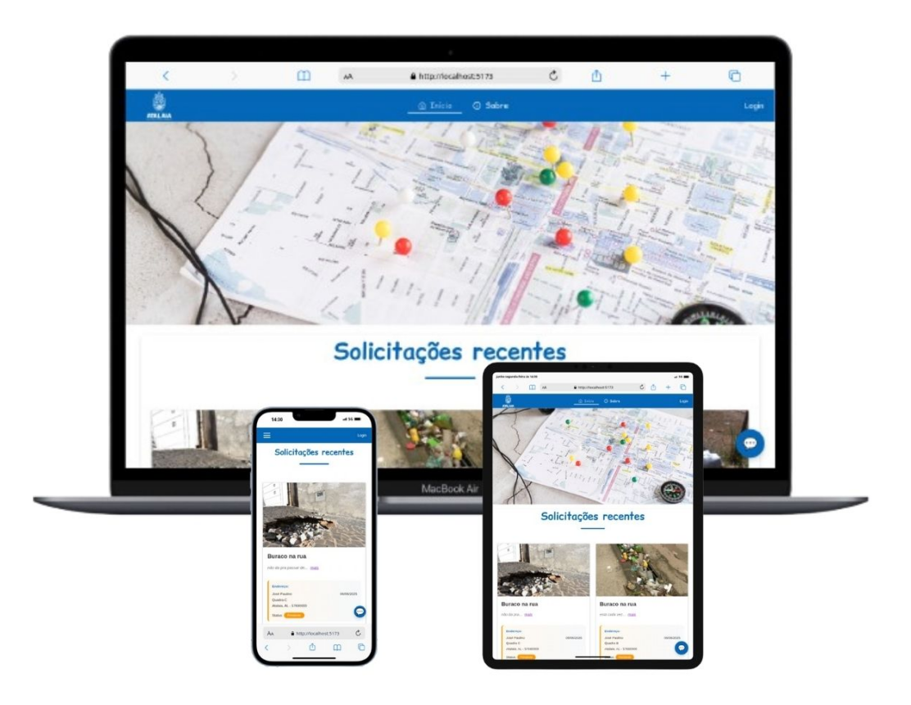

# 🌍 Protocol Frontend

[](https://reactjs.org/)
[](https://www.typescriptlang.org/)
[](https://vitejs.dev/)

Frontend desenvolvido em React para sistema de solicitações de serviços públicos, integrando visualização em mapas e cards informativos com geolocalização.

 <!-- Substitua por screenshot real -->

## ✨ Funcionalidades

- 📋 Listagem de solicitações recentes com cards detalhados
- 🗺 Visualização em mapa interativo (React Leaflet)
- 📸 Galeria de fotos por solicitação (Swiper)
- 🔐 Autenticação segura com JWT e Crypto-js
- 📝 Formulários validados com Zod e React Hook Form
- 🔄 Gerenciamento de estado com React Query
- 🛡️ Rotas protegidas por níveis de acesso

## 🛠️ Stack Tecnológica

### Core
- React 19 + TypeScript
- Vite (build tool)
- Material UI (design system)
- Styled Components (estilização)

### Funcionalidades
- React Leaflet + Leaflet (mapas)
- Swiper (carrossel de imagens)
- Axios (requisições HTTP)
- React Query (gerenciamento de dados)

### Segurança & Validação
- JWT Decode + Crypto-js (autenticação)
- Zod (validação de schemas)
- React Hook Form (formulários)

## 🚀 Como Executar Localmente

### Pré-requisitos
- Node.js 18+
- npm 9+

### Instalação

## 🔐 Variáveis de Ambiente

Crie um arquivo `.env` na raiz do projeto com as seguintes variáveis:

```env
# URL base da API backend
VITE_API_URL=http://localhost:3000/example

# Chave da API Gemini
VITE_GEMINI_API_KEY=sua_chave_aqui

```

## 📦 Scripts Disponíveis

| Comando         | Descrição                              |
|-----------------|----------------------------------------|
| `npm run dev`   | Inicia servidor de desenvolvimento com hot reload |
| `npm run build` | Compila a aplicação para produção      |
| `npm run preview` | Previsualiza o build de produção localmente |
| `npm run lint`  | Executa ESLint para análise estática do código |


```bash
git clone https://github.com/piciliano/protocol-frontend.git
cd protocol-frontend
npm install

## Estrutura do Projeto

├── public
│   ├── favicon.ico
│   └── vite.svg
├── src
│   ├── api
│   │   ├── apiConfig
│   │   │   ├── apiClient.ts
│   │   │   └── gemini.ts
│   │   └── routes
│   │       ├── auth.ts
│   │       ├── forgotPassword.ts
│   │       ├── getRequest.ts
│   │       ├── getRequestByUserLogged.ts
│   │       ├── patchStatusForRequest.ts
│   │       ├── pathRoleByEmail.ts
│   │       ├── postRequest.ts
│   │       ├── register.ts
│   │       ├── resetPassword.ts
│   │       └── validateCode.ts
│   ├── assets
│   │   ├── acceptedremove.png
│   │   ├── atalaiaaleatorio.jpg
│   │   ├── atalaiahd-remove.png
│   │   ├── atalaiahd.jpg
│   │   ├── descreverremove.png
│   │   ├── localizacaoremove.png
│   │   ├── maosremovebg.png
│   │   ├── mapa.jpg
│   │   └── semarquivosemfundo.png
│   ├── components
│   │   ├── about
│   │   │   ├── index.tsx
│   │   │   └── styled.ts
│   │   ├── button
│   │   │   ├── index.tsx
│   │   │   ├── styled.ts
│   │   │   └── types.d.ts
│   │   ├── card
│   │   │   ├── index.tsx
│   │   │   └── styled.ts
│   │   ├── chat
│   │   │   ├── index.tsx
│   │   │   └── styled.ts
│   │   ├── drawer
│   │   │   ├── index.tsx
│   │   │   └── styled.ts
│   │   ├── expandedText
│   │   │   └── index.tsx
│   │   ├── footer
│   │   │   ├── index.tsx
│   │   │   └── styled.ts
│   │   ├── formRequest
│   │   │   ├── index.tsx
│   │   │   └── styled.ts
│   │   ├── geocodeMap
│   │   │   ├── index.tsx
│   │   │   └── styled.ts
│   │   ├── header
│   │   │   ├── index.tsx
│   │   │   └── styled.ts
│   │   ├── info
│   │   │   ├── index.tsx
│   │   │   └── styled.ts
│   │   ├── input
│   │   │   ├── index.tsx
│   │   │   ├── styled.ts
│   │   │   └── types.ts
│   │   ├── layout
│   │   │   └── index.tsx
│   │   ├── loginMenu
│   │   │   ├── index.tsx
│   │   │   └── styled.ts
│   │   ├── mapView
│   │   │   └── index.tsx
│   │   └── menu
│   │       ├── index.tsx
│   │       └── styled.ts
│   ├── pages
│   │   ├── home
│   │   │   ├── index.tsx
│   │   │   └── styled.ts
│   │   ├── login
│   │   │   ├── index.tsx
│   │   │   └── styled.ts
│   │   ├── moderator
│   │   │   ├── index.tsx
│   │   │   └── styled.ts
│   │   ├── recovery
│   │   │   ├── index.tsx
│   │   │   └── styled.ts
│   │   ├── register
│   │   │   ├── index.tsx
│   │   │   └── styled.ts
│   │   └── request
│   │       ├── index.tsx
│   │       └── styled.ts
│   ├── routes
│   │   ├── protectRoute.tsx
│   │   ├── publicRoute.tsx
│   │   └── routes.tsx
│   ├── schemas
│   │   ├── login.ts
│   │   └── register.ts
│   ├── styles
│   │   ├── globalStyles.ts
│   │   └── theme.ts
│   ├── App.tsx
│   ├── main.tsx
│   ├── styled.d.ts
│   └── vite-env.d.ts
├── .env
├── .gitignore
├── README.md
├── eslint.config.js
├── index.html
├── package-lock.json
├── package.json
├── tsconfig.app.json
├── tsconfig.json
├── tsconfig.node.json
└── vite.config.ts
```

## 📁 Estrutura do Projeto - Visão Detalhada

### `public/` 📌
**Arquivos estáticos públicos**  
Ícones, imagens básicas e assets que não precisam de processamento

### `src/` 🏗️
**Código-fonte principal da aplicação**

#### `api/` 🌐
- `apiConfig/` - Configurações base da API (client HTTP, interceptores)
- `routes/` - Definições específicas de endpoints (auth, solicitações, etc)

#### `assets/` 🖼️  
Imagens, ícones e recursos visuais usados na interface

#### `components/` 🧩  
**Componentes reutilizáveis** (organizados por funcionalidade):
- `card/` - Componente de card de solicitação
- `mapView/` - Visualização de mapas interativos
- `formRequest/` - Formulários de solicitação
- ...e outros componentes especializados

#### `pages/` 📄  
**Páginas principais da aplicação**:
- `home/` - Página inicial
- `login/` - Autenticação de usuários
- `moderator/` - Painel do moderador
- ...demais páginas por rota

#### `routes/` 🛣️  
Configuração do sistema de rotas:
- Rotas públicas
- Rotas protegidas por autenticação
- Configuração principal de navegação

#### `schemas/` 📋  
Esquemas de validação com Zod:
- Validação de formulários
- Tipagem de dados da API

#### `styles/` 🎨  
- Estilos globais
- Definição do tema (Material UI)
- Tipagens para Styled Components

### `Arquivos Raíz` 🏁
| Arquivo          | Função                                                                 |
|------------------|-----------------------------------------------------------------------|
| `App.tsx`        | Componente raiz da aplicação                                          |
| `main.tsx`       | Ponto de entrada (renderização React + providers globais)             |
| `vite.config.ts` | Configuração do Vite (plugins, build optimization)                    |
---


## 👤 Autor

[](https://github.com/piciliano)  
[Neto](https://github.com/piciliano)
